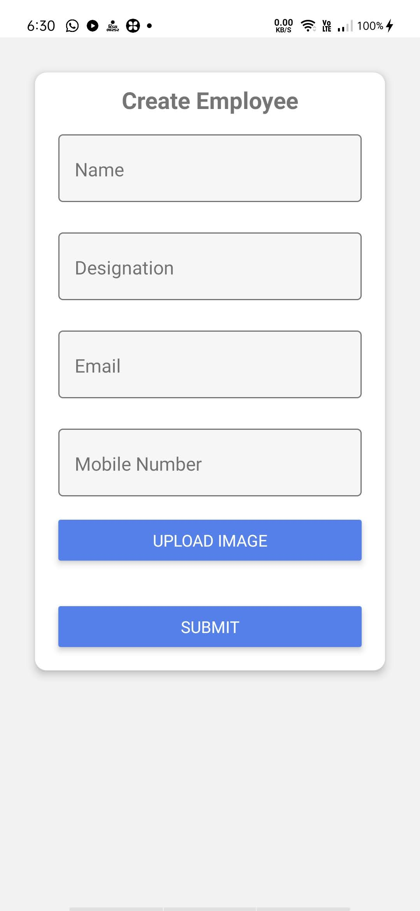
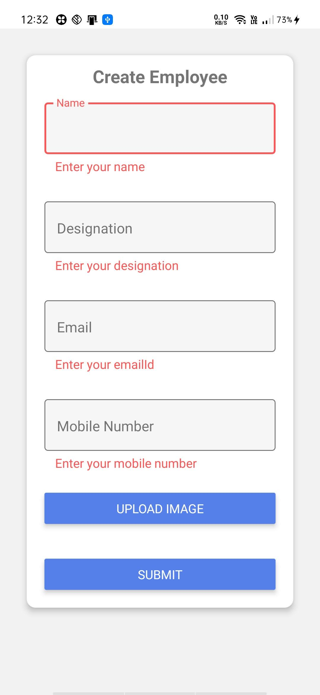
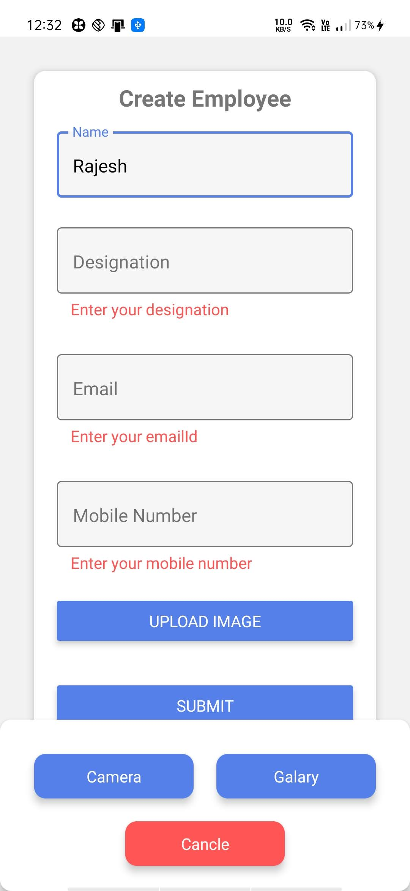

# myApp
This is React-native app
This app made with 
- Front-end => react-native
- back-end => nodeJs, expressJS
- database => mongoDB

React-native package i used in project: 
- react-navigation 
- react-native-paper
- react-native-image-upload
- redux

This app connect with server run with node js 
server packeges are:
- expressJS
- body-parser
- mongoose 
- 
For upload employee image used cloudinary cloud

This app is Employee management system 
our application provide Add Employee,Edit employee and fire employee 
Display all employee in home page 

## Preveiew of Application 

